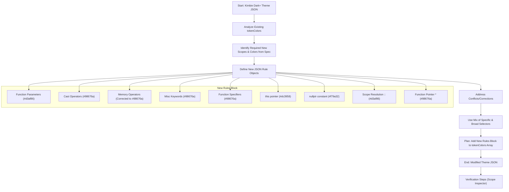

# Kimbie Dark+ C++ Enhancement Implementation Plan

This document outlines the plan to modify the Kimbie Dark+ theme to better support C++ syntax highlighting using the "Better C++ Syntax" extension, based on the specification in `docs/cpp_upgrade_spec.md`.

**1. Goal Confirmation:**
Modify `themes/Kimbie Dark+-color-theme.json` to add TextMate token color rules for enhanced C++ scopes provided by the "Better C++ Syntax" extension, using the existing Kimbie Dark+ color palette as defined in the specification.

**2. Analysis of Existing Theme:**
*   The theme file (`themes/Kimbie Dark+-color-theme.json`) uses the expected color palette (e.g., `#d3af86` for default text/punctuation, `#98676a` for keywords/storage, `#dc3958` for variables, `#f06431` for types, `#f79a32` for constants).
*   Existing rules provide a base, but some require adjustments:
    *   `variable.parameter.function` is currently Red (`#dc3958`), needs changing to Beige (`#d3af86`).
    *   `keyword.operator` is Beige (`#d3af86`). Casts, `new`, `delete` need specific rules with the Keyword color (`#98676a`).
    *   `keyword.operator.new` is currently colored as a Function (`#8ab1b0`), needs correction to Keyword color (`#98676a`).
    *   Other relevant base colors (`storage`, `constant`, `variable`, `punctuation`) are correctly defined.
*   `semanticHighlighting` is enabled. TextMate rules will be applied first as per the spec.

**3. Proposed Changes (New/Modified `tokenColors` Rules):**

The following rules will be added to the `tokenColors` array in `themes/Kimbie Dark+-color-theme.json`, placed near the end for correct precedence:

```json
// Proposed additions/modifications to tokenColors array

// --- C++ Enhancements Start ---

{
    "name": "C++ Function Parameters",
    "scope": [
        "variable.parameter.cpp",
        "variable.parameter.function" // Override existing rule for parameters
    ],
    "settings": {
        "foreground": "#d3af86" // Beige (Spec: Line 28, 77)
    }
},
{
    "name": "C++ Cast Operators",
    "scope": [
        "keyword.operator.cast.static_cast.cpp",
        "keyword.operator.cast.dynamic_cast.cpp",
        "keyword.operator.cast.reinterpret_cast.cpp",
        "keyword.operator.cast.const_cast.cpp"
    ],
    "settings": {
        "foreground": "#98676a" // Brown/Purple (Keyword) (Spec: Line 32, 79)
    }
},
{
    "name": "C++ Memory Allocation Operators",
    "scope": [
        "keyword.operator.new.cpp", // Ensure correct color
        "keyword.operator.delete.cpp",
        "keyword.operator.new", // Override existing rule for 'new'
        "keyword.operator.delete" // Explicitly cover non-.cpp scope too
    ],
    "settings": {
        "foreground": "#98676a" // Brown/Purple (Keyword) (Spec: Line 55, 80)
    }
},
{
    "name": "C++ Misc Keywords",
    "scope": [
        "keyword.other.using.directive.cpp", // Spec: Line 47, 81
        "keyword.other.operator.overload.cpp", // Spec: Line 51, 82
        "keyword.other.default.constructor.cpp" // Spec: Line 83
    ],
    "settings": {
        "foreground": "#98676a" // Brown/Purple (Keyword)
    }
},
{
    "name": "C++ Function Specifiers (override, final, constexpr, etc.)",
    // Using a broader selector scoped to C++ for maintainability
    "scope": [
        "source.cpp storage.modifier.specifier", // Catches override, final, constexpr, virtual, explicit, inline (Spec: Line 39, 43, 85, 207)
        "storage.modifier.lambda.mutable.cpp" // Lambda mutable (Spec: Line 86)
    ],
    "settings": {
        "foreground": "#98676a" // Brown/Purple (Keyword/Storage)
    }
},
{
    "name": "C++ 'this' pointer",
    "scope": "variable.language.this.cpp", // Explicit rule for 'this' (Spec: Line 63, 87)
    "settings": {
        "foreground": "#dc3958" // Red (Variable)
    }
},
{
    "name": "C++ nullptr constant",
    // Explicit rule in case the general 'constant' rule doesn't catch it
    "scope": "constant.language.nullptr.cpp", // Spec: Line 59, 88
    "settings": {
        "foreground": "#f79a32" // Orange (Constant)
    }
},
{
    "name": "C++ Scope Resolution Operator",
    // Explicit rule for clarity, though likely covered by general punctuation
    "scope": [
        "punctuation.separator.scope-resolution.cpp",
        "punctuation.separator.namespace.access" // Common alternative scope
    ],
    "settings": {
        "foreground": "#d3af86" // Beige (Punctuation/Operator) (Spec: Line 71, 89)
    }
},
{
    "name": "C++ Function Pointer Type Modifier",
    // If needed based on testing
    "scope": "storage.type.function.pointer.cpp", // Spec: Line 67, 90
    "settings": {
        "foreground": "#98676a" // Brown/Purple (Storage/Keyword)
    }
}

// --- C++ Enhancements End ---
```

**4. Implementation Method:**
*   Directly edit the `themes/Kimbie Dark+-color-theme.json` file.
*   Add the new rules as a block *before* the final closing `]` of the `tokenColors` array.

**5. Verification Plan:**
*   After applying the changes, reload VS Code.
*   Open a C++ file with various constructs (function parameters, casts, `override`, `final`, `constexpr`, `this`, `nullptr`, `::`, etc.).
*   Use the "Developer: Inspect Editor Tokens and Scopes" command to verify:
    *   The correct TextMate scopes are being applied by the "Better C++ Syntax" extension.
    *   The new rules from the modified theme file are matching these scopes and applying the intended Kimbie Dark+ colors.
    *   Check for any unintended color changes or uncolored tokens.

**Plan Visualization:**

